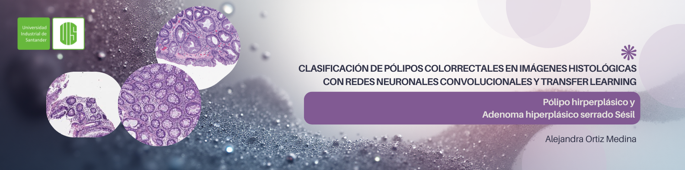

# Clasificación de Pólipos Colorrectales en Imágenes Histológicas con Redes Neuronales Convolucionales y Transfer Learning

---

## Autores

[Alejandra Ortiz Medina]

---

## Objetivo del Proyecto

Clasificar imágenes de muestras histopatológicas para determinar si son pólipos de tipo hiperplásico o adenocarcinoma uyilizando Transfer Learning.

---

## Dataset

Este proyecto utiliza el dataset **MHIST** (Minimalist Histopathology Image Analysis Dataset).

* **Descripción:** Imágenes histopatológicas de pólipos de colon clasificadas como Hiperplásicos (HP) o Adenomas Serrados Sésiles (SSA).
* **Fuente y Descarga:** [https://bmirds.github.io/MHIST/]

---

## Modelos y Métodos Usados

* **Transfer Learning** (Fine-Tuning por etapas)
* **Arquitecturas CNN:** DenseNet201, ResNet50, Xception
* **Estrategia de Ensamble:** Soft Voting (Promedio Simple/Ponderado)
* **Regularización:** Data Augmentation, oversampling y congelamiento de BatchNormalization 

---

## Enlaces

**Repositorio GitHub:** [https://github.com/AlejaOM/classification_mhist]
**Notebook Colab:** [https://colab.research.google.com/drive/11k0DLI8WfnEN_3GgIipBkse5sGnvYxs8?usp=sharing]
